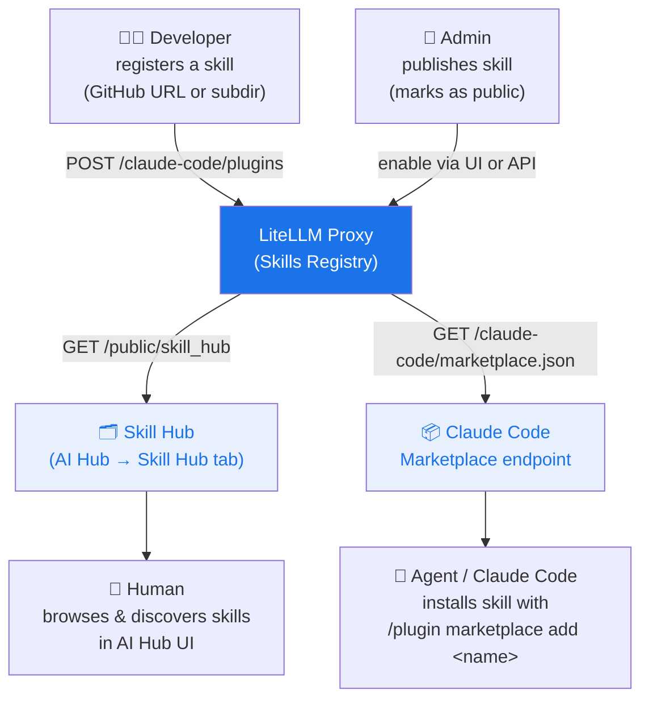

# Skills Gateway

# Skills Gateway

<iframe width="840" height="500" src="https://www.loom.com/embed/cb74eb79df3e4c2b83a6efae54a589f9" frameborder="0" webkitallowfullscreen mozallowfullscreen allowfullscreen></iframe>

LiteLLM acts as a **Skills Registry** — a central place to register, manage, and discover Claude Code skills across your organization. Teams can publish skills once and have agents and developers find them through a single hub.

## How it works



## Quick start

### 1. Register a skill

Paste any GitHub URL into the Skills UI — LiteLLM auto-detects the source type and skill name.

```bash
curl -X POST https://your-proxy/claude-code/plugins \
  -H "Authorization: Bearer $LITELLM_KEY" \
  -H "Content-Type: application/json" \
  -d '{
    "name": "grill-me",
    "source": {
      "source": "git-subdir",
      "url": "https://github.com/mattpocock/skills",
      "path": "grill-me"
    },
    "description": "Interview skill for relentless questioning",
    "domain": "Productivity",
    "namespace": "interviews"
  }'
```

Skills nested in subdirectories (e.g. `github.com/org/repo/tree/main/skill-name`) are supported — LiteLLM parses the URL automatically in the UI.

### 2. Publish to hub

In the Admin UI: **AI Hub → Skill Hub → Select Skills to Make Public**.

Or via API:

```bash
curl -X POST https://your-proxy/claude-code/plugins/grill-me/enable \
  -H "Authorization: Bearer $LITELLM_KEY"
```

### 3. Browse the hub

Public skills appear at:
- **Admin UI**: AI Hub → Skill Hub tab
- **Public page**: `/ui/model_hub` → Skill Hub tab (no login required)
- **API**: `GET /public/skill_hub`

### 4. Install in Claude Code

Point Claude Code at your proxy marketplace once:

```json title="~/.claude/settings.json"
{
  "extraKnownMarketplaces": {
    "my-org": {
      "source": "url",
      "url": "https://your-proxy/claude-code/marketplace.json"
    }
  }
}
```

Then install any skill:

```
/plugin marketplace add grill-me
```

## Skill fields

| Field | Description |
|-------|-------------|
| `name` | Unique skill identifier (used in `/plugin marketplace add`) |
| `source` | Git source — `github`, `url`, or `git-subdir` |
| `description` | Short description shown in the hub |
| `domain` | Category for grouping (e.g. `Engineering`, `Productivity`) |
| `namespace` | Subcategory within a domain (e.g. `quality`, `meetings`) |
| `keywords` | Tags for search and filtering |
| `version` | Semver string |

## API reference

| Endpoint | Auth | Description |
|----------|------|-------------|
| `POST /claude-code/plugins` | Required | Register a skill |
| `GET /claude-code/plugins` | Required | List all skills (admin) |
| `POST /claude-code/plugins/{name}/enable` | Required | Publish a skill |
| `POST /claude-code/plugins/{name}/disable` | Required | Unpublish a skill |
| `GET /public/skill_hub` | None | List public skills |
| `GET /claude-code/marketplace.json` | None | Claude Code marketplace manifest |
