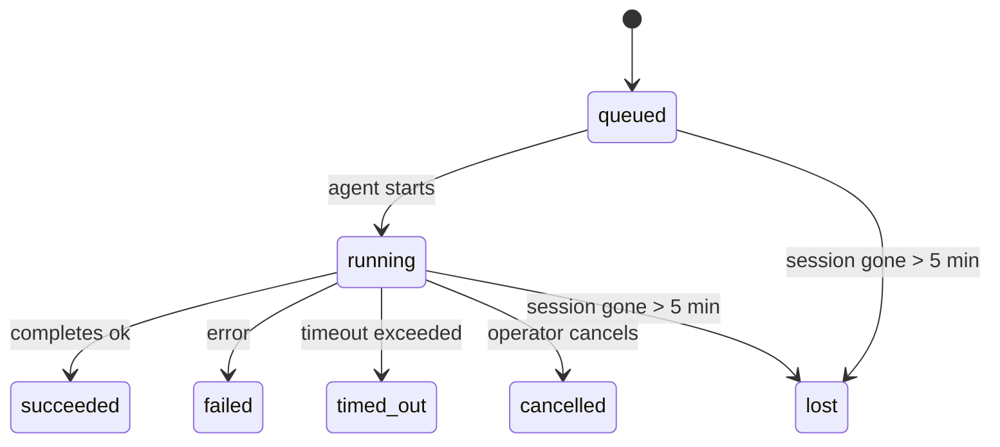

# Background Tasks

> **Looking for scheduling?** See [[cron-jobs|Scheduled Tasks]] for choosing the right mechanism. This page covers **tracking** background work, not scheduling it.

Background tasks track work that runs **outside your main conversation session**:
ACP runs, subagent spawns, isolated cron job executions, and CLI-initiated operations.

Tasks do **not** replace sessions, cron jobs, or heartbeats — they are the **activity ledger** that records what detached work happened, when, and whether it succeeded.

<Note>
Not every agent run creates a task. Heartbeat turns and normal interactive chat do not. All cron executions, ACP spawns, subagent spawns, and CLI agent commands do.
</Note>

## TL;DR

- Tasks are **records**, not schedulers — cron and heartbeat decide _when_ work runs, tasks track _what happened_.
- ACP, subagents, all cron jobs, and CLI operations create tasks. Heartbeat turns do not.
- Each task moves through `queued → running → terminal` (succeeded, failed, timed_out, cancelled, or lost).
- Cron tasks stay live while the cron runtime still owns the job; chat-backed CLI tasks stay live only while their owning run context is still active.
- Completion is push-driven: detached work can notify directly or wake the requester session/heartbeat when it finishes, so status polling loops are usually the wrong shape.

## What Creates a Task

| Source                 | Runtime type | When a task record is created                          | Default notify policy |
| ---------------------- | ------------ | ------------------------------------------------------ | --------------------- |
| ACP background runs    | `acp`        | Spawning a child ACP session                           | `done_only`           |
| Subagent orchestration | `subagent`   | Spawning a subagent via `sessions_spawn`               | `done_only`           |
| Cron jobs (all types)  | `cron`       | Every cron execution (main-session and isolated)       | `silent`              |
| CLI operations         | `cli`        | `openclaw agent` commands that run through the gateway | `silent`              |
| Agent media jobs       | `cli`        | Session-backed `video_generate` runs                   | `silent`              |

Main-session cron tasks use `silent` notify policy by default — they create records for tracking but do not generate notifications. Isolated cron tasks also default to `silent` but are more visible because they run in their own session.

## Task Lifecycle



| Status      | What it means                                                              |
| ----------- | -------------------------------------------------------------------------- |
| `queued`    | Created, waiting for the agent to start                                    |
| `running`   | Agent turn is actively executing                                           |
| `succeeded` | Completed successfully                                                     |
| `failed`    | Completed with an error                                                    |
| `timed_out` | Exceeded the configured timeout                                            |
| `cancelled` | Stopped by the operator via `openclaw tasks cancel`                        |
| `lost`      | The runtime lost authoritative backing state after a 5-minute grace period |

Transitions happen automatically — when the associated agent run ends, the task status updates to match.

## Delivery and Notifications

When a task reaches a terminal state, OpenClaw notifies you. There are two delivery paths:

**Direct delivery** — if the task has a channel target (the `requesterOrigin`), the completion message goes straight to that channel (Telegram, Discord, Slack, etc.). For subagent completions, OpenClaw also preserves bound thread/topic routing when available.

**Session-queued delivery** — if direct delivery fails or no origin is set, the update is queued as a system event in the requester's session and surfaces on the next heartbeat.

<Tip>
Task completion triggers an immediate heartbeat wake so you see the result quickly — you do not have to wait for the next scheduled heartbeat tick.
</Tip>

### Notification Policies

Control how much you hear about each task:

| Policy                | What is delivered                                                       |
| --------------------- | ----------------------------------------------------------------------- |
| `done_only` (default) | Only terminal state (succeeded, failed, etc.) — **this is the default** |
| `state_changes`       | Every state transition and progress update                              |
| `silent`              | Nothing at all                                                          |

Change the policy while a task is running:
```bash
openclaw tasks notify <lookup> state_changes
```

## Related Pages

- [[tasks-cli|Tasks CLI Reference]] — CLI commands for managing and inspecting tasks
- [[tasks-storage|Tasks Storage and Maintenance]] — storage, automatic maintenance, and integration with other systems
